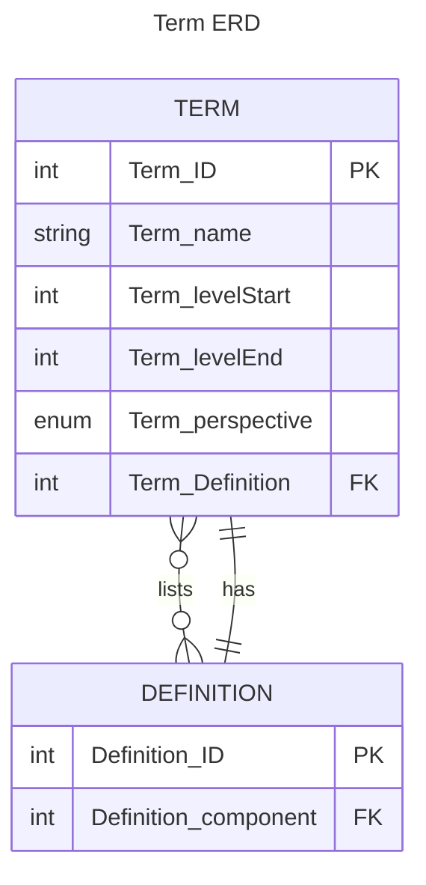

```mermaid
---
title: Term ERD
---
erDiagram
    TERM }o--o{ DEFINITION : lists
    TERM {
        int Term_ID PK
        string Term_name
        int Term_levelStart
        int Term_levelEnd
        enum Term_perspective
        int Term_Definition FK
    }
    DEFINITION ||--|| TERM : has
    DEFINITION{
        int Definition_ID PK
        int Definition_component FK
    }

```

