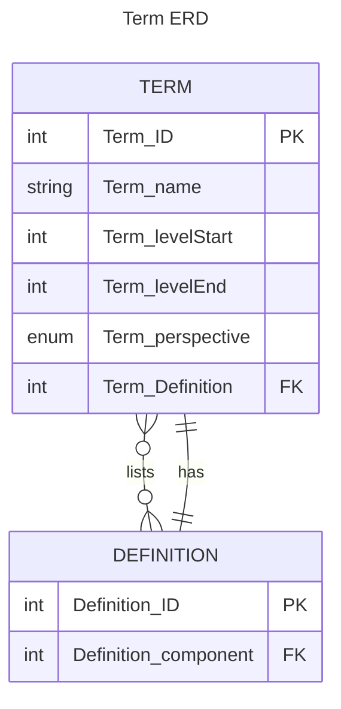

Een curriculum is een ontwerp van een Opleiding, Samengesteld door een onderwijsvertegenwoordiger, Waarvan de subOnderwijsontwerpen staan in een Cursusontwerp-volgorde, Gericht op de realisatie van één of meerdere Eindkwalificatie, Met één of meerdere Opleidingstoelatingseisen, Waarvan de samenstelling is onderbouwd door één of meerdere Leerlijn of
