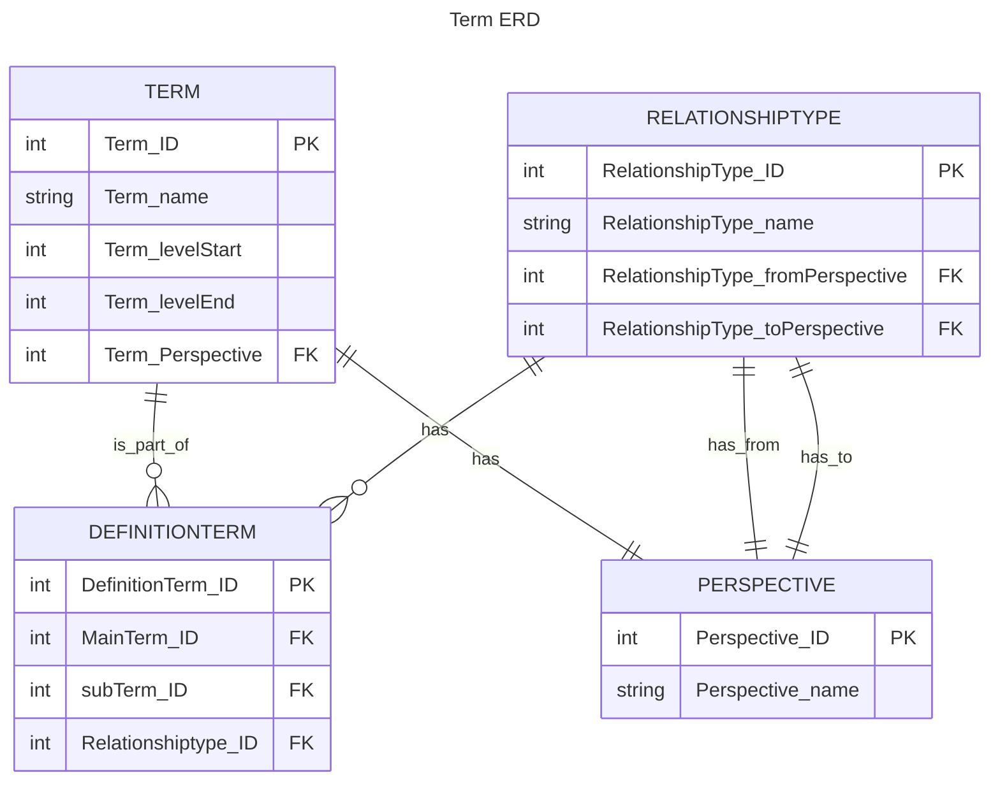

```mermaid
---
title: Term ERD
---
erDiagram
    TERM {
        int Term_ID PK
        string Term_name
        int Term_levelStart
        int Term_levelEnd
        int Term_Perspective FK
    }
    DEFINITIONTERM{
        int DefinitionTerm_ID PK
        int MainTerm_ID FK
        int subTerm_ID FK
        int Relationshiptype_ID FK
    }
    PERSPECTIVE{
        int Perspective_ID PK
        string Perspective_name
    }
    RELATIONSHIPTYPE{
        int RelationshipType_ID PK
        string RelationshipType_name
        int RelationshipType_fromPerspective FK
        int RelationshipType_toPerspective FK
    }

    TERM ||--o{ DEFINITIONTERM : is_part_of
    RELATIONSHIPTYPE ||--o{ DEFINITIONTERM : has
    TERM ||--|| PERSPECTIVE : has
    RELATIONSHIPTYPE ||--|| PERSPECTIVE : has_from
    RELATIONSHIPTYPE ||--|| PERSPECTIVE : has_to

```
