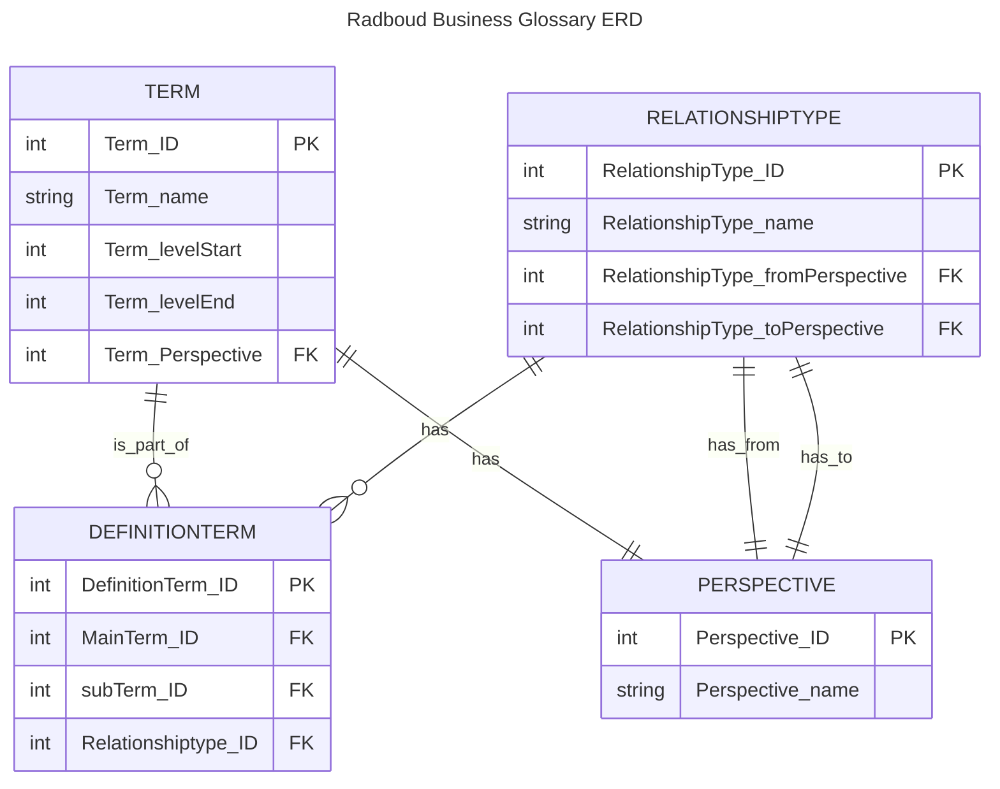

# Harmonisch Woordenboek voor het onderwijs

## Overzicht

De Radboud universiteit is bezig met een project om een harmonische, consistente, en eenduidige terminologie binnen de Universiteit te waarborgen. Met als toekomst visie om dit binnen de gehele onderwijs sector te ondersteunen. De applicatie die dit project ondersteund, bestaat uit drie hoofdcomponenten:

1. **ERD (Entity-Relationship Diagram)** - Het datamodel van de glossary.
2. **API** - Een backend-service voor het beheren en opvragen van termen.
3. **Webapplicatie** - Een gebruikersinterface voor interactie met de glossary.

## Installatie & Gebruik

### Vereisten

- Node.js
- Python
- Docker (Optioneel, is gebruikt voor het hosten van de database)

### Stappen

1. **Clone de repository**

   ```sh
   git clone https://github.com/MichielLangen/RU_business_glossary.git
   cd radboud-business-glossary

   ```

2. **Installeer de benodigde packages**

   ```sh
   #installatie van node.js modules
   cd '\website'
   npm i

   #installatie van python modules
   pip install flask, flask_cors

   ```

3. **Creër de database**

   In de database folder staat een script om een database te maken volgens het ERD wat ook in die folder staat. Hierbij zijn ook scripts toegevoegd om de database te vullen met de huidige data.

## Architectuur & Componenten

### Database

Het ERD definieert de belangrijkste entiteiten en relaties binnen de glossary. Het is gemaakt met de [mermaid](https://mermaid.js.org/intro/) tool. In de database zelf wordt alleen text data opgeslagen en is op het moment 170mb groot. Mocht dit in de toekomst ook als docker container gehost worden het geheugen dat gebruikt word is ongeveer 1.3gb



### API

De API bied endpoints voor het beheren en ophalen van termen en definieties. De endpoints zoals die nu bestaan zijn:

- `GET /onderwijsontwerp` - Haalt alle data op van de termen.
  - De response van dit enpoint is een lijst van json objecten die er als volgt uit zien:
    ```
    {
        "DefinitionTerm": [],
        "Term_ID": 2,
        "Term_Perspective": 2,
        "Term_Perspective_Name": "Samenstellingonderbouwing",
        "Term_levelEnd": 7,
        "Term_levelStart": 4,
        "Term_name": "Leerlijn"
    }
    ```
- `GET /admin` - Haalt de verschillende perspectieven, relaties, en termen op.
  - De response van dit endpoint is een lijst van json objecten die er als volgt uit zien:
    ```
    [
        {
            "1": {
                "Perspective_ID": 1,
                "Perspective_name": "Onderwijsontwerp"
            },
        },
        {
            "1": {
                "fromPerspective": 1,
                "rel_ID": 1,
                "rel_text": ", is een samenstelling van één of meerdere",
                "toPerspective": 1
            },
        },
        {
            "1": {
                "levelEnd": 7,
                "levelStart": 7,
                "term_ID": 1,
                "term_name": "Curriculum",
                "term_perspective": 1
            },
        }
    ]
    ```
- `POST /admin` - Voegt een nieuwe term met alle relaties toe.
  - Het verwachte json object voor dit endpoint bestaat uit twee delen. Ten eerste de informatie over de nieuwe term zoals term naam, het niveau, en het perspectief. Het tweede gedeelde is een lijst van term_ids van termen die in de definitie staan. Het object ziet er als volgt uit:
    ```
    [
        {
            'Term_name': 'New Term',
            'Term_levelStart': 1,
            'Term_levelEnd': 1,
            'Term_Perspective': 1
        },
        [
            2,
            3
        ]
    ]
    ```

### Webaplicatie

De webaplicatie bestaat op dit moment uit 4 pagina's.

1. `Hoofdpagina`. Op dit moment is deze leeg
2. `Woordenboek`. Hier is tabel te zien met alle termen, welk niveau ze hebben, er welk perspectief.
3. `CDM`. Hierop is een visuele weergave van de onderlinge relatie tussen termen te zien.
4. `Manage`. Op deze pagina is het mogelijk om nieuwe termen toe te voegen.

Alle componenten staan in de folder `src/Components`, en zijn per pagina gegroepeerd. Sommige ondersteunende funtions zijn ondergebracht in de folder `src/Constants`. Denk hierbij aan het vullen van een dictionary of het opstellen van de definitie zin voor termen.
